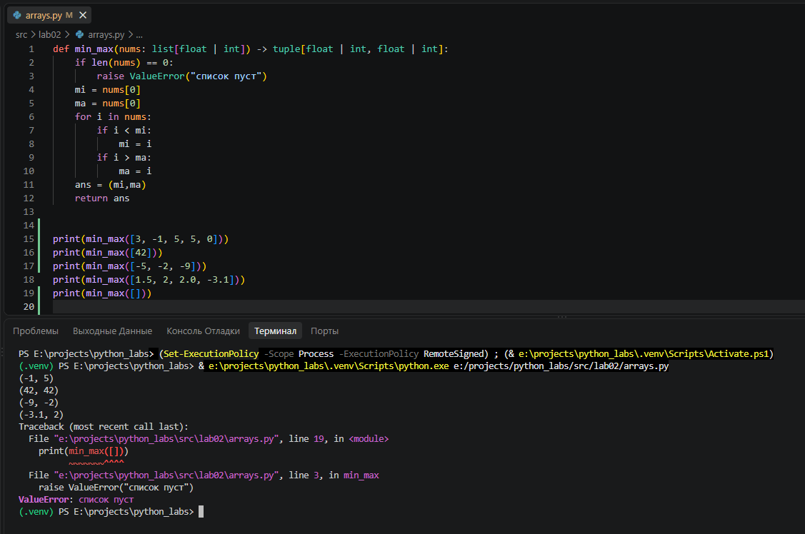
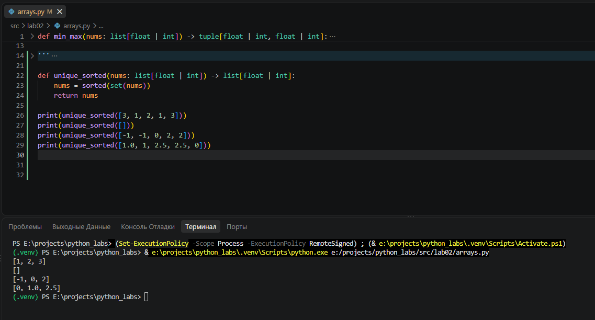
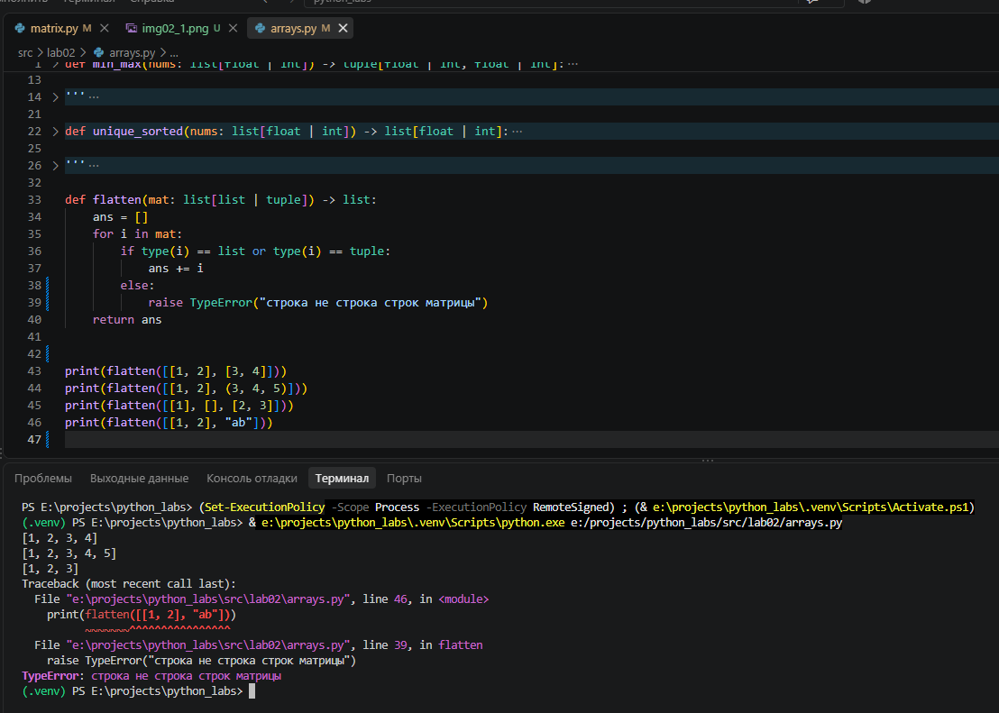
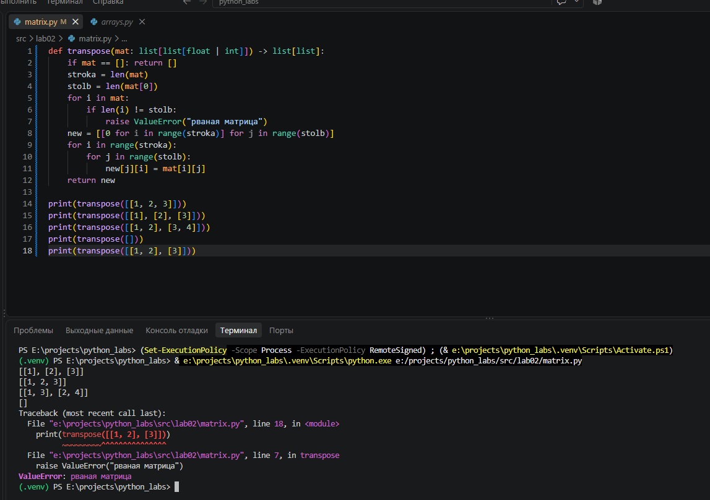
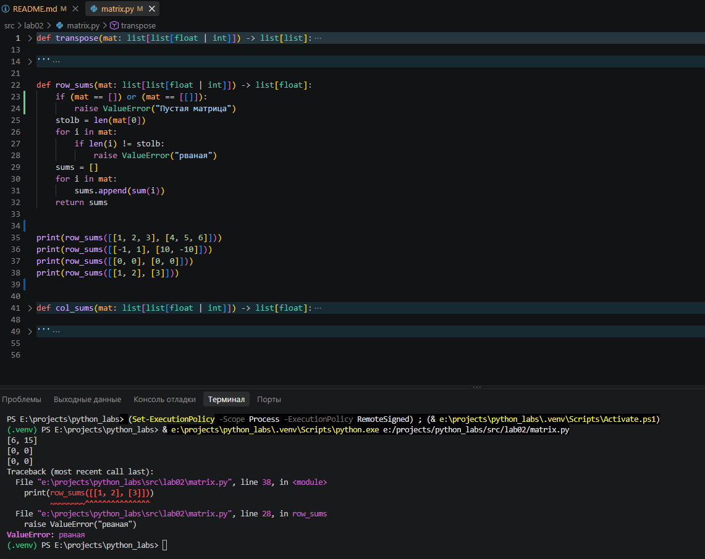
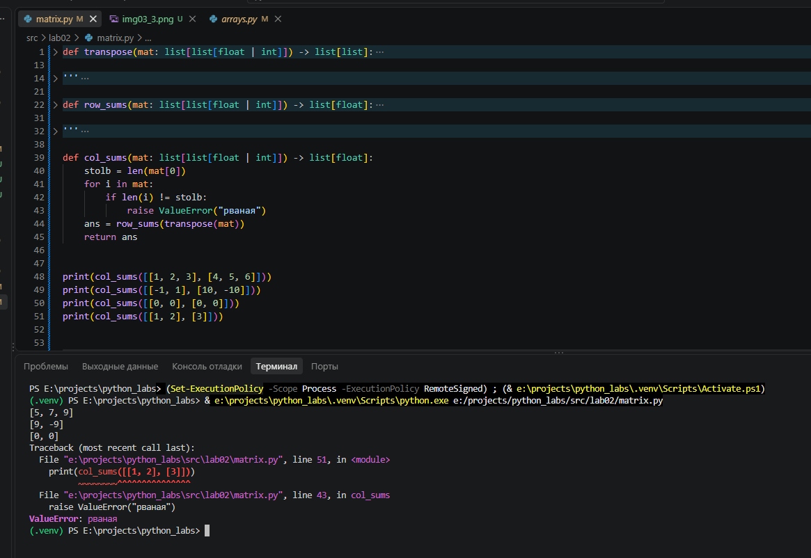
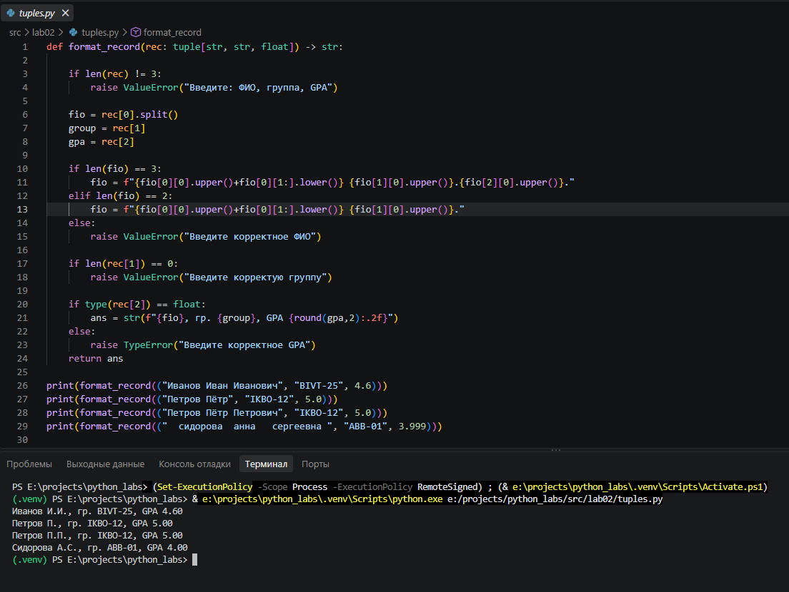

# ЛР2 — Коллекции и матрицы (list/tuple/set/dict)

## Задание 1

Написал три функции:

Эта функция находит минимальный и максимальный элементы списка.

Эта функция возвращает отсортированный список уникальных значений (по возрастанию).

Эта функция «расплющивает» список списков/кортежей в один список по строкам.

## Задание 2

Написал три функции:

Эта функция меняет строки и столбцы местами.

Эта функция считает сумму по каждой строке.

Эта функция считает сумму по каждому столбцу.

## Задание 3 

Написал функцию, которая обрабатывает данные вида: «Фамилия Имя Отчество, группа, GPA»

