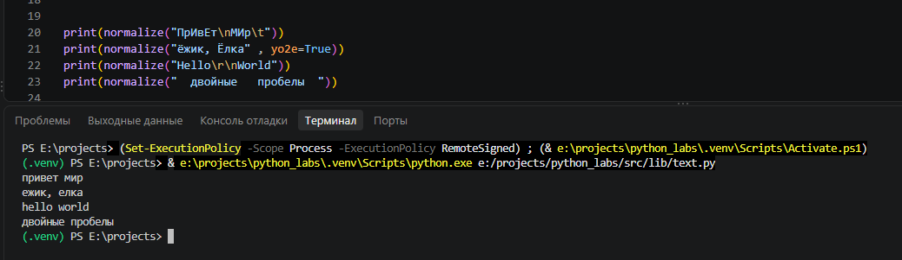
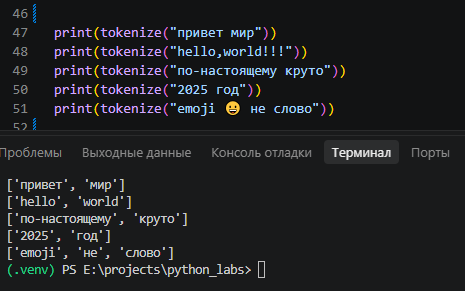
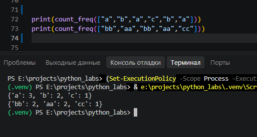
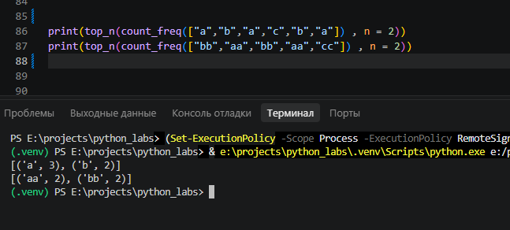

# ЛР3 — Тексты и частоты слов (словарь/множество)

## Задание A — src/lib/text.py

## normalize

Нормализация. Преобразование строки s в norm(s):
1. Нормализует
2. заменяет все ё/Ё на е/Е
3. заменяет управляющие символы \\t, \\r, \\n на пробел
4. «схлопывает» последовательности пробелов в один

```python
def normalize(text: str, *, casefold: bool = True, yo2e: bool = True) -> str:

    '''
    Нормализация. Преобразование строки s в norm(s):
    1) Нормализует
    2) заменяет все ё/Ё на е/Е
    3) заменяет управляющие символы \\t, \\r, \\n на пробел
    4) «схлопывает» последовательности пробелов в один
    '''

    text = text.replace("\t"," ")
    text = text.replace("\n"," ")
    text = text.replace("\r"," ")

    if yo2e:
        text = text.replace("ё","е")
        text = text.replace("Ё","Е")

    if casefold:
        text = text.casefold()

    text = " ".join(text.split())
        
    return text.strip()
```





## tokenize

Токенизация. Множество слов — это все подстроки, удовлетворяющие шаблону:
\w+(?:-\w+)*
(буквы/цифры/подчёркивание; допускается дефис внутри слова), разделённые любыми не-\w символами.

```python
def tokenize(text: str) -> list[str]:

    '''
    Токенизация. Множество слов — это все подстроки, удовлетворяющие шаблону \w+(?:-\w+)*
    (буквы/цифры/подчёркивание; допускается дефис внутри слова), разделённые любыми не-\w символами.
    '''

    tokens = re.findall('\w+(?:-\w+)*',text)
    return tokens
```




## count_freq

Частоты. Для списка токенов T = [t₁, …, tₙ] частота слова w равна:
f(w) = |{ i : tᵢ = w }|.

```python
def count_freq(tokens: list[str]) -> dict[str, int]:

    '''
    Частоты. Для списка токенов T = [t₁, …, tₙ] частота слова w равна
    f(w) = |{ i : tᵢ = w }|.
    '''

    freq = {}

    for i in tokens:
        if i in freq:
            freq[i] += 1
        else:
            freq[i] = 1
            
    return freq
```




## top_n

Топ-N. Отсортировать пары (слово, частота) по ключу (-частота, слово) и взять первые N.

```python
def top_n(freq: dict[str, int], n: int = 5) -> list[tuple[str, int]]:

    '''
    Топ-N. Отсортировать пары (слово, частота) по ключу (-частота, слово) и взять первые N.
    '''

    ans_freq = sorted(freq.items(), key=lambda x: (-x[1],x[0]))
    return ans_freq[:n]
```

